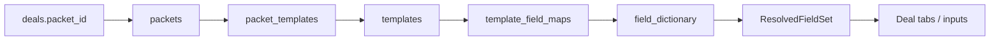
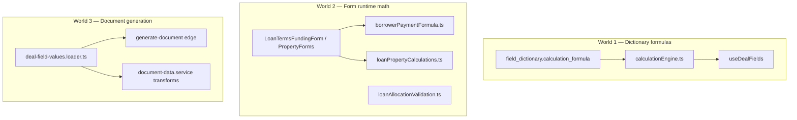
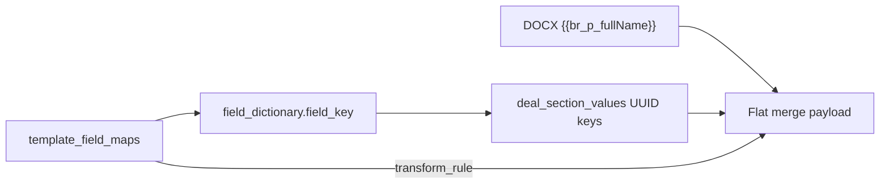
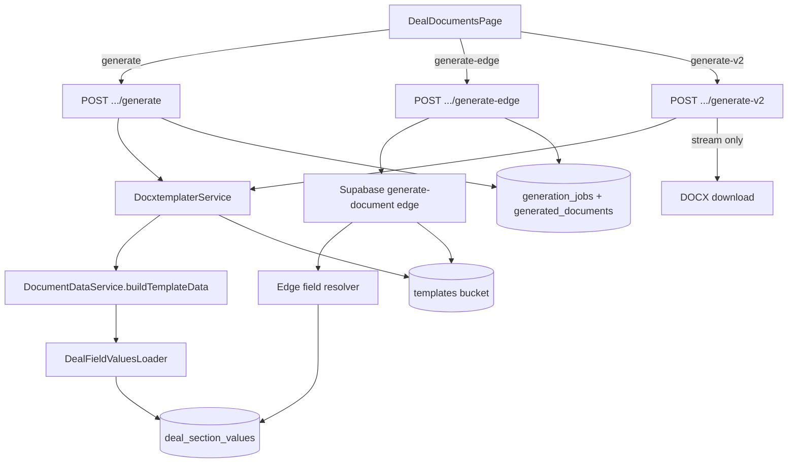
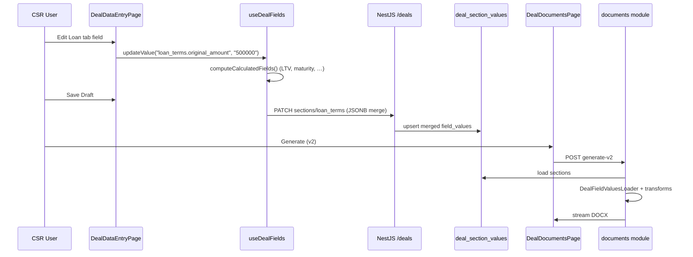

# Application Architecture — Deal Data, Calculations & Templates

**Branch:** `migration_v1`  
**Updated:** 2026-06-06  
**Audience:** Developers tracing how deal data flows from CSR entry → storage → document generation.

---

## Table of Contents

1. [System layers](#1-system-layers)
2. [Deal sections, tabs & fields](#2-deal-sections-tabs--fields)
3. [Calculations — three worlds](#3-calculations--three-worlds)
4. [Templates — schema, mapping & generation](#4-templates--schema-mapping--generation)
5. [End-to-end data flow](#5-end-to-end-data-flow)
6. [Known architectural gaps](#6-known-architectural-gaps)

---

## 1. System layers

```mermaid
flowchart TB
  subgraph ui [React UI :8080]
    DDE[DealDataEntryPage]
    DDP[DealDocumentsPage]
    Hook[useDealFields]
    Calc[calculationEngine.ts]
    Forms[Section forms / modals]
  end

  subgraph svc [Frontend services]
    SV[section-values.service]
    Gen[generation.service]
    Admin[field-dictionary.service]
    Maps[template-field-maps.service]
  end

  subgraph api [NestJS :3000]
    Deals[deals module]
    Docs[documents module]
    AdminM[admin module]
  end

  subgraph db [(PostgreSQL)]
    FD[field_dictionary]
    DSV[deal_section_values]
    TFM[template_field_maps]
    TPL[templates]
  end

  DDE --> Hook
  Hook --> Calc
  Hook --> SV
  DDP --> Gen
  SV --> Deals
  Gen --> Docs
  Deals --> DSV
  Deals --> FD
  Docs --> DSV
  Docs --> TFM
  Docs --> TPL
  Admin --> FD
```

| Layer | Role |
|-------|------|
| **field_dictionary** | Master schema — every field's key, section, type, formula |
| **deal_section_values** | Runtime deal data — one JSONB blob per `(deal_id, section)` |
| **template_field_maps** | Which dictionary fields each template needs + transforms + required flag |
| **packets** | Bundle of templates assigned to a deal — drives visible/required fields in UI |

---

## 2. Deal sections, tabs & fields

### 2.1 Database model

Each deal stores field values in **`deal_section_values`**:

```text
deal_section_values
├── deal_id
├── section          ← enum field_section (borrower, loan_terms, property, …)
├── field_values       ← JSONB map
└── version
```

**JSONB storage shape** (keys are almost never human-readable field keys):

```json
{
  "550e8400-e29b-41d4-a716-446655440000": {
    "value_text": "Dallas",
    "indexed_key": "property1.city",
    "updated_at": "...",
    "updated_by": "..."
  },
  "borrower1::660e8400-e29b-41d4-a716-446655440001": {
    "value_text": "Jane",
    "indexed_key": "borrower1.first_name"
  }
}
```

| Storage key pattern | Meaning |
|---------------------|---------|
| `{uuid}` | Single-entity field (dictionary row ID) |
| `{prefix}::{uuid}` | Repeatable entity (borrower2, lender1, lien3, charge1) |
| `indexed_key` property | UI dot-notation alias preserved on save |

**Unique constraint:** one row per `(deal_id, section)`.

### 2.2 Field dictionary — the schema

**Table:** `field_dictionary`

| Column | Purpose |
|--------|---------|
| `field_key` | Canonical merge key (e.g. `br_p_fullName`, `ln_p_originalAmount`) |
| `section` | `field_section` enum — where the field belongs |
| `data_type` | text, currency, date, boolean, dropdown, json, … |
| `is_calculated` | If true, value comes from `calculation_formula` |
| `calculation_formula` | e.g. `({ln_p_originalAmount} / {pr_p_appraisedValue}) * 100` |
| `calculation_dependencies` | Field keys that must be filled first |
| `is_repeatable` | Supports multiple instances (lender1, lender2) |
| `form_type` | primary / secondary — sub-form grouping |
| `is_mandatory` | Always required in UI validation (independent of template) |

There are **38+ `field_section` enum values** in Postgres; the CSR UI uses a **subset** mapped to tabs.

### 2.3 Tabs vs sections vs forms

**Deal Data Entry** (`DealDataEntryPage.tsx`) renders **navbar tabs** that are *not* 1:1 with DB sections:

| UI tab | DB section(s) | Component |
|--------|---------------|-----------|
| Participants | `participants` (custom) | `ParticipantsSectionContent` |
| Loan | `loan_terms` | `LoanTermsSectionContent` (Details, Balances, Servicing sub-forms) |
| Property | `property` | `PropertySectionContent` |
| Funding | `loan_terms` (funding JSON) | `LoanTermsFundingForm` |
| Charges | `charges` | `ChargesSectionContent` |
| Conversation Log | `notes` (+ merged sections) | `NotesSectionContent` |
| Events Journal | event_journal table | `EventJournalViewer` |
| Other Origination | `origination_fees` | `OriginationFeesSectionContent` |

Borrower, co-borrower, lender, broker, escrow, insurance, liens, seller sections exist in `field_dictionary` but are often reached via **contact portfolio modals** or nested sub-forms rather than top-level tabs.

**Tab order** (UI):

```text
participants → loan_terms → property → funding → charges → notes → event_journal → origination_fees
```

**Section order** (field resolver):

```text
borrower → co_borrower → property → loan_terms → lender → broker → charges → dates → escrow → origination_fees → insurance → liens → notes → seller
```

### 2.4 Three naming conventions (critical)

The same logical field can appear under three names:

| Layer | Example | Used by |
|-------|---------|---------|
| **UI legacy dot-notation** | `borrower.full_name`, `loan_terms.original_amount` | React forms, `values` map in memory |
| **Dictionary DB key** | `br_p_fullName`, `ln_p_originalAmount` | `field_dictionary`, DOCX merge tags |
| **JSONB storage key** | UUID or `borrower1::{uuid}` | `deal_section_values.field_values` |

**Translation layer:** `src/lib/legacyKeyMap.ts` (~1500 lines) maps legacy ↔ DB keys.

`useDealFields` applies this on **load** (UUID → indexed_key → legacy key) and **save** (legacy key → DB key → UUID storage key).

### 2.5 How fields become visible & required



**Resolver:** `src/lib/requiredFieldsResolver.ts`

| Mode | When | Visible fields | Required fields |
|------|------|----------------|-----------------|
| **Packet mode** | Deal has `packet_id` | Union of all `template_field_maps.field_dictionary_id` across packet templates | Any map row with `required_flag = true` |
| **Fallback mode** | No packet | All dictionary fields in `SECTION_ORDER` | None (empty required set) |

Output: `ResolvedFieldSet` with:
- `fieldsBySection` — grouped for tab rendering
- `visibleFieldKeys` / `requiredFieldKeys` — completeness checks
- `transform_rules` — per-field formatting hints from maps

**Mark-ready gate:** `isPacketReadyForMark()` checks **template-required fields only** (not all mandatory dictionary fields).

**Value lookup for completeness:** `getValueForResolvedField()` tries DB key, legacy key, and indexed variants (`borrower1.*` … `borrower9.*`).

### 2.6 Load & save path (`useDealFields`)

**Load pipeline:**

1. Wait for field dictionary cache
2. `resolvePacketFields(packetId)` or `resolveAllFields()`
3. Merge TMO/extra sections from dictionary
4. `GET /deals/:id/sections` → parse JSONB
5. Map UUID storage keys → `values` map (legacy dot-notation keys)
6. Run calculated fields (`computeCalculatedFields`)

**Save pipeline (`saveDraft`):**

1. Collect dirty field keys
2. For each key: legacy → DB key → `field_dictionary_id`
3. Build JSONB cell with typed columns + optional `indexed_key`
4. Group by section → `PATCH /deals/:id/sections/:section`
5. Backend **merges** JSONB (does not replace entire blob)

**Multi-entity fields:** prefix `borrower2::uuid` on save; `indexed_key: "borrower2.first_name"` for round-trip.

---

## 3. Calculations — three worlds

Calculations are **not unified**. Three separate mechanisms coexist:



### 3.1 World 1 — Dictionary-driven (deal-field relative)

**Where defined:** Admin → Field Dictionary (`is_calculated = true`)

**Engine:** `src/lib/calculationEngine.ts`

**When it runs:** Browser only, inside `useDealFields`:
- On load after hydration
- After field edits (`updateValue`)
- Before save (`saveDraft`)

**Formula syntax** (stored in DB):

| Pattern | Example |
|---------|---------|
| Date + months | `{first_payment_date} + {term_months} months` |
| Date + days | `{origination_date} + 30 days` |
| Arithmetic | `{loan_amount} * {rate}` |
| Chained (LTV-style) | `({ln_p_originalAmount} / {pr_p_appraisedValue}) * 100` |

**Dependency resolution:**
- Fields sorted by dependency count (lightweight topological order)
- Computed values merged into working map so later calcs can chain
- Missing dependency → field skipped (`computed: false`)

**UI behavior:** Calculated fields render **disabled** in `DealFieldInput` (user cannot edit).

**Important:** These formulas are **not re-run on the server** during document generation. Generated docs use whatever was saved (or bridges in the loader).

### 3.2 World 2 — Static / runtime form math

Hard-coded TypeScript in specific forms. **Not stored in field_dictionary.**

| Module | What it computes | Where used |
|--------|------------------|------------|
| `borrowerPaymentFormula.ts` | Regular payment from principal, rate, term, amortization method | `LoanTermsBalancesForm`, `RE885ProposedLoanTerms` |
| `loanPropertyCalculations.ts` | LTV, CLTV, lien sums, loan amount aliases | `PropertyDetailsForm`, `PropertySectionContent`, `PropertyModal` |
| `loanAllocationValidation.ts` | Sold rate vs lender allocations, penalty distributions | `DealDataEntryPage` mark-ready validation |
| `LoanTermsFundingForm` | Pro-rata totals from funding records | Funding tab (auto-fills `loan_terms.pro_rata`) |
| `OriginationFeesForm` | Fee grid subtotals, page totals | Origination fees tab |
| `interestValidation.ts` / `precisionFormat.ts` | Decimal precision rules per field type | Input formatting |

**Characteristics:**
- Runs **at UI interaction time** (useMemo, onChange, useEffect)
- Uses the in-memory `values` map (legacy keys)
- Results may or may not be persisted — depends on whether the form calls `onValueChange`
- **Static** = formula is in code, not admin-configurable
- **Deal-field relative** = reads other fields from the same deal's `values` map
- **Runtime** = recalculates on every relevant edit; not cached in DB unless saved

### 3.3 World 3 — Document generation math

**Server-side**, at merge time:

| Location | Role |
|----------|------|
| `deal-field-values.loader.ts` | Loads JSONB → flat `field_key → rawValue` map; applies bridges (RE885 aliases, lender loops, `br_p_fullName` auto-compute) |
| `document-data.service.ts` | Applies `transform_rule` formatting (currency, date, checkbox glyphs, words-to-dollars) |
| `lenders.builder.ts` | Builds `lenders[]` / `additionalLenders[]` loop arrays |
| `re851d-properties.builder.ts` | Builds `properties[]` loop for RE851D |
| Edge `generate-document/index.ts` | Full v1 engine — extensive publishers, checkbox logic, `_N` column expansion (~12k lines) |

**v2 (docxtemplater)** uses Worlds 1+2 outputs **as saved in JSONB**, plus loader bridges. It does **not** re-run `calculationEngine.ts`.

---

## 4. Templates — schema, mapping & generation

### 4.1 Template schema (database)

```text
templates
├── id, name, state, product_type, version
├── file_path          ← Supabase storage path to DOCX
├── is_active
└── template_field_maps[]

template_field_maps
├── template_id
├── field_dictionary_id
├── required_flag      ← drives CSR "required" + mark-ready
├── transform_rule     ← currency | date_long | checkbox | …
└── display_order

packets
├── state, product_type, name
└── packet_templates[] → templates

deals.packet_id → which packet (and thus which fields/templates)
```

**Template identity:** unique on `(name, state, product_type, version)`.

**`_vDT` suffix convention:** docxtemplater test copies (e.g. `re885-1_vDT`). Field maps fall back to the parent template name (strip `_vDT`) when the copy has no maps.

### 4.2 Template key mapping — four layers



| Layer | Links to next |
|-------|---------------|
| **DOCX merge tag** | Must match a resolved output key in merge payload |
| **template_field_maps** | Links template → dictionary ID; optional transform + required |
| **field_dictionary** | Canonical `field_key` + section + type |
| **deal_section_values** | UUID-keyed JSONB; loader resolves to `field_key` |

**Gap:** Bulk-imported templates often have tags in the DOCX but **zero `template_field_maps` rows**. In that case:
- UI packet resolver returns **empty visible/required sets**
- Generation still works if loader bridges resolve tags from JSONB
- Required-field completeness checks do not apply

### 4.3 Loading template required values (UI)

**Purpose:** Drive progress bar, tab badges, mark-ready button.

**Flow:**

1. Deal has `packet_id`
2. `resolvePacketFields(packetId)` loads maps → dictionary → `requiredFieldKeys`
3. `useDealFields` hydrates `values` from sections
4. `getMissingTemplateRequiredFields(resolved, values)` → list of unfilled required fields
5. `isPacketReadyForMark()` → boolean for status transition

**Without packet:** all fields visible (fallback), none required by template.

**Inspect (v2):** separate path — parses DOCX tags via docxtemplater InspectModule, scopes payload to tags found in template:

```
GET /deals/:id/documents/field-data-v2?templateId=
  → DocumentDataService.buildTemplateData()
  → DocxtemplaterService.enrichFieldDataFromTemplateBuffer()
  → applyTemplateInspect() — only tags in DOCX + condition driver fields
```

Returns per-tag resolved values + condition evaluation (`ld_p_lenderType == 'Individual'`).

### 4.4 Document generation paths



| Path | Engine | Persists | Template syntax |
|------|--------|----------|-----------------|
| **generate** | NestJS docxtemplater | ✅ | v2-style `{{#expr}}` |
| **generate-edge** | Deno edge (Lovable original) | ✅ | v1 `#if`, `(eq ...)`, XML repair |
| **generate-v2** | NestJS docxtemplater | ❌ stream | v2 only — clean Word tags |

**Shared data loader (v2 / generate):**

1. `DealFieldValuesLoader.loadByFieldKey(dealId)` — read all sections, UUID → field_key
2. Apply bridges: lenders, RE885 aliases, `br_p_fullName`, RE851D properties
3. Load `template_field_maps` → build transform map
4. `applyTransform()` per field (currency, dates, checkboxes)
5. `buildNestedObjects()` — `broker.first_name` → `{ broker: { first_name: "..." } }`
6. docxtemplater renders DOCX

**v1 edge additional logic (not in v2):** participant loops, entity-type conditionals, checkbox glyph repair, `_N` table columns, origination fee page publishers.

### 4.5 Transform rules

Defined on `template_field_maps.transform_rule` (or inferred from `data_type`):

| Rule | Output |
|------|--------|
| `currency` | `$1,234.56` |
| `currency_words` | `One Thousand … and 00/100 Dollars` |
| `date_mmddyyyy` | `06/06/2026` |
| `checkbox` | `☑` / `☐` |
| `uppercase` / `titlecase` | Case conversion |
| `percentage` | `7.500%` |
| `phone` / `ssn_masked` | Formatted PII |

---

## 5. End-to-end data flow



**Key invariant:** UI saves via **UUID keys** in JSONB; documents read via **field_key** flat map. The loader + legacyKeyMap bridge the gap.

---

## 6. Known architectural gaps

| Gap | Impact |
|-----|--------|
| **Three naming layers** not auto-synced | Empty merge fields, hydration misses, required-field false negatives |
| **Empty template_field_maps** on imported templates | No packet required/visible fields; generation relies on loader bridges |
| **Calculations split across 3 worlds** | UI-calculated values may differ from doc output if not saved |
| **Dictionary calcs browser-only** | Server generation does not re-run `calculationEngine.ts` |
| **v1 vs v2 template syntax** | Same DOCX cannot work on both engines without conversion — see [`DOCXTEMPLATER_TEMPLATE_CONVERSION.md`](./DOCXTEMPLATER_TEMPLATE_CONVERSION.md) |
| **Full JSONB replace was fixed to merge** | Partial saves no longer wipe sections (backend fix) |
| **Multi-tab workspace race** | Multiple `useDealFields` instances can conflict on load |

---

## Quick reference — key files

| Topic | File |
|-------|------|
| Field resolver / required | `src/lib/requiredFieldsResolver.ts` |
| Load/save orchestration | `src/hooks/useDealFields.ts` |
| Legacy ↔ DB key map | `src/lib/legacyKeyMap.ts` |
| Dictionary formulas | `src/lib/calculationEngine.ts` |
| Payment formula | `src/lib/borrowerPaymentFormula.ts` |
| LTV/CLTV helpers | `src/lib/loanPropertyCalculations.ts` |
| Deal data entry UI | `src/pages/csr/DealDataEntryPage.tsx` |
| Document generation UI | `src/pages/csr/DealDocumentsPage.tsx` |
| v2 merge loader | `backend/src/modules/documents/deal-field-values.loader.ts` |
| Transform + payload | `backend/src/modules/documents/document-data.service.ts` |
| docxtemplater | `backend/src/modules/documents/docxtemplater.service.ts` |
| Template inspect | `backend/src/modules/documents/template-inspect.util.ts` |
| v1 edge reference | `supabase/functions/generate-document/index.ts` |
| **v1 → v2 conversion guide** | `docs/DOCXTEMPLATER_TEMPLATE_CONVERSION.md` |
| Prisma models | `backend/prisma/schema.prisma` |
